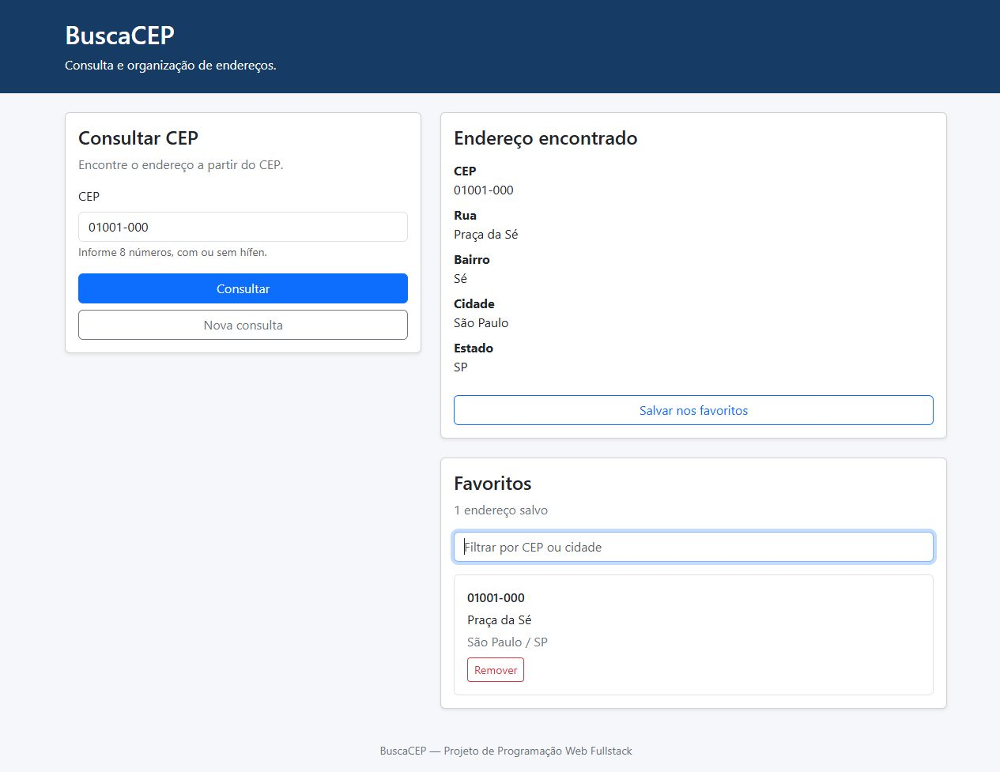
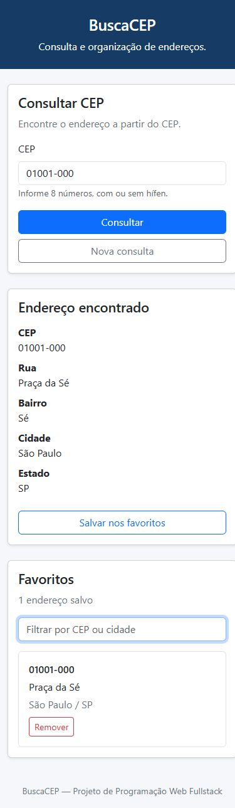

# BuscaCEP

Projeto 1 da disciplina **Programação Web Fullstack**.

## Vídeo de apresentação

[Assistir à apresentação do BuscaCEP](https://drive.google.com/file/d/1T4KilHRoxRo8FDZfn-kD7MSb--cZ4dlw/view?usp=drive_link)

## Objetivo

Desenvolver uma aplicação React de página única (SPA) para consultar endereços pelo CEP utilizando a API ViaCEP e organizar os resultados em favoritos. As consultas são feitas com AJAX, sem recarregar a página.

## Situação atual

Décima segunda etapa: favoritos completos, com salvamento sem duplicação, listagem, remoção, filtro por CEP ou cidade, persistência no localStorage e acabamento visual responsivo.

## Integrantes e responsabilidades

Divisão de responsabilidades conforme o desenvolvimento registrado no Git:

| Integrante | Responsabilidade | Etapas do plano |
| --- | --- | --- |
| Felippe Costa | Estrutura, consulta à API, validações, erros e useRef | 1 a 6 |
| Rafael de Godoy Vianna | Favoritos, filtro, persistência e acabamento visual | 7 a 12 |

## Tecnologias

- React e JavaScript para a interface e a lógica.
- Vite para desenvolvimento e geração da versão de produção.
- React Bootstrap e Bootstrap para componentes visuais e layout responsivo.
- useState para controlar o formulário, favoritos e filtro.
- useEffect para sincronizar os favoritos com o localStorage.
- API ViaCEP e fetch com async/await para consultar endereços.
- useRef para acessar e focar o campo de CEP.
- localStorage para manter os favoritos no navegador.

## Como executar

Pré-requisito: Node.js 22.12 ou superior. Esta etapa foi validada com Node.js 24.

Na pasta do projeto, instale as dependências:

```bash
npm install
```

Inicie o servidor de desenvolvimento:

```bash
npm run dev
```

Abra no navegador o endereço informado pelo terminal. Para encerrar o servidor, pressione Ctrl+C.

## Comandos disponíveis

| Comando | Finalidade |
| --- | --- |
| npm run dev | Iniciar o ambiente de desenvolvimento |
| npm run lint | Verificar o código com Oxlint |
| npm run build | Gerar a versão de produção na pasta dist |
| npm run preview | Visualizar localmente a versão gerada pelo build |

## Estrutura do projeto

```text
src/
  components/
    FormularioCEP.jsx  Campo, envio e validação do CEP
    ResultadoEndereco.jsx  Exibição dos dados recebidos por props
    Favoritos.jsx  Lista, filtro e remoção dos favoritos
  services/
    viacep.js  Requisição à API ViaCEP
    favoritos.js  Leitura e validação dos favoritos salvos
  App.jsx       Componente principal e estado dos favoritos
  main.jsx      Inicialização do React
  styles.css    Estilos básicos e responsivos
index.html      Página HTML que recebe a aplicação
vite.config.js  Configuração do Vite
```

## Funcionalidades do projeto

- Consultar CEP com ou sem hífen.
- Validar a entrada e tratar carregamento e erros.
- Exibir CEP, rua, bairro, cidade e estado.
- Iniciar nova consulta e focar o campo com useRef.
- Salvar favoritos sem duplicação.
- Listar e remover favoritos.
- Filtrar favoritos por CEP com ou sem hífen ou por cidade.
- Exibir a quantidade de favoritos e informar quando o filtro não encontra resultados.
- Persistir favoritos no navegador com localStorage.
- Adaptar a interface para celular e computador.

Os favoritos ficam apenas no navegador utilizado. As consultas dependem de internet e da disponibilidade da API.

## Fluxo dos favoritos

1. Depois de consultar um CEP, o usuário pode salvar o endereço.
2. O App verifica se o CEP já está nos favoritos antes de adicionar.
3. O componente Favoritos mostra os endereços salvos.
4. O usuário pode pesquisar por CEP ou cidade no campo de filtro.
5. O botão Remover exclui o favorito pelo CEP.
6. O useEffect salva a lista atual no localStorage.
7. Ao abrir a aplicação novamente, os favoritos salvos são carregados.

## Referência da API

[Documentação do ViaCEP](https://viacep.com.br/)

Exemplo de endpoint: `https://viacep.com.br/ws/01001000/json/`.

## Uso de useRef

O formulário cria a referência campoCep com useRef(null) e a associa ao campo por meio da propriedade ref. Depois que o campo aparece na tela, campoCep.current aponta para o elemento de entrada. A chamada campoCep.current.focus() coloca o cursor nesse elemento.

Isso ocorre quando o formato é inválido ou quando o usuário clica em “Nova consulta”. O texto digitado continua em useState; useRef é usado apenas para acessar o campo. Alterar uma referência não provoca uma nova renderização.

## Roteiro de verificação manual

- Enviar um campo vazio ou um CEP incompleto: exibir erro e focar o campo.
- Consultar 01001000 e 01001-000: mostrar o endereço da Praça da Sé, em São Paulo/SP.
- Durante a consulta: mostrar carregamento e desabilitar o campo e os dois botões.
- Consultar 00000000: mostrar CEP não encontrado e liberar os controles.
- Após um resultado, salvar o endereço nos favoritos.
- Tentar salvar o mesmo CEP novamente: manter apenas um favorito.
- Filtrar por parte do CEP ou pelo nome da cidade.
- Remover um favorito e verificar que ele desaparece da lista.
- Recarregar a página e verificar que os favoritos continuam salvos.
- Clicar em “Nova consulta”: limpar campo, resultado e mensagens, mantendo o foco no campo.
- Digitar outro CEP e pressionar Enter: consultar sem recarregar a página.

## Tratamento do armazenamento

A função carregarFavoritos usa try/catch para tratar falhas de leitura ou JSON inválido. Se o conteúdo não for uma lista, começa com uma lista vazia. Registros inválidos são ignorados, preservando os endereços válidos. A comparação dos CEPs ignora o hífen para evitar duplicação.

A gravação também usa try/catch. Se o navegador não permitir salvar, a aplicação continua funcionando e avisa que as alterações serão mantidas somente enquanto a página estiver aberta.

## Verificações realizadas em 07/10/2026

| Verificação | Resultado |
| --- | --- |
| npm run build e npm run lint | Aprovados |
| Consulta real de 01001-000 no navegador | Endereço da Praça da Sé exibido |
| Salvar o mesmo endereço duas vezes | Um favorito mantido |
| Filtro por 01001000 e cidade | Endereço encontrado |
| Filtro sem correspondências | Mensagem exibida, sem apagar favoritos |
| Contador | Atualizado ao salvar e remover |
| Recarregar após salvar e após remover | Alterações persistidas |
| Leitura com JSON inválido, null, objeto e registros malformados | Verificada em teste isolado da função: sem exceção e somente registros válidos retornados |
| Acesso ao armazenamento bloqueado | Leitura simulada: lista vazia, sem exceção |
| Layout em 1280 px e 390 px | Rodapé abaixo dos favoritos, sem rolagem horizontal |

Validação do campo, foco com useRef, carregamento, CEP inexistente e limpeza com “Nova consulta” também foram verificados no navegador durante a revisão anterior desta mesma versão da consulta.

## Capturas da aplicação

### Computador



### Celular



## Roteiro de apresentação

1. Felippe apresenta o objetivo, a SPA, os componentes e a biblioteca React Bootstrap.
2. Demonstra uma entrada inválida e explica useState, validação, eventos e foco com useRef.
3. Consulta um CEP válido e explica fetch, async/await, JSON, props e tratamento de carregamento e erros.
4. Rafael salva o resultado, tenta duplicá-lo e explica o estado compartilhado no App.
5. Filtra por cidade e CEP, demonstra uma busca sem resultados e explica filter e map.
6. Recarrega a página, remove o favorito e explica useEffect e localStorage.
7. Mostram a adaptação para celular, as responsabilidades e o histórico de commits.

Antes da entrega, conferir no GitHub se o repositório está público e enviar as alterações locais. A apresentação é obrigatória conforme o enunciado da disciplina.
